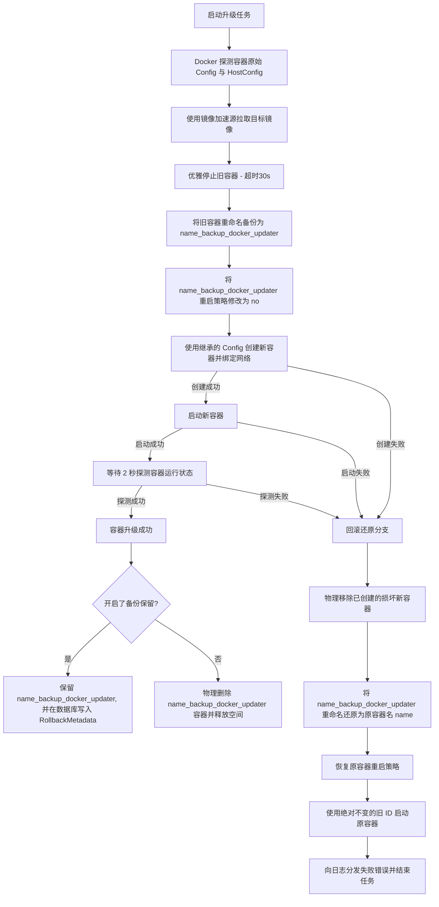
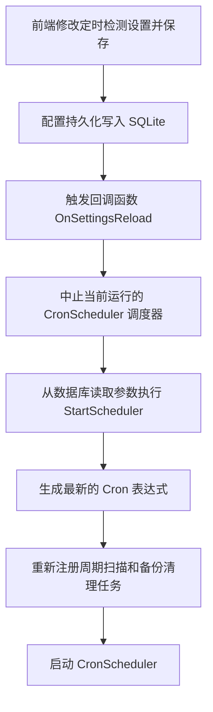

# 飞牛 FNOS Docker 容器升级管理器技术规格书 (Agent 面向)

## 1. 技术栈与部署约束
* **后端技术**: Go (无 CGO) + Gin + GORM + glebarez/sqlite。
* **启动与监听模式**:
  - **飞牛模式**（携带 `--fnos` 参数启动）：
    - 核心依赖：必须存在环境变量 `TRIM_APPDEST`。若缺失，程序直接终止退出。
    - 执行动作：监听 `${TRIM_APPDEST}/web.sock`。设置套接字文件读写权限为 `0666`。启动时自动清理历史残留套接字文件。
    - 数据/日志目录：优先使用环境变量 `TRIM_PKGVAR`。若缺失，则默认为 `./data`。
  - **原生模式**（无启动参数，默认）：
    - 核心依赖：不依赖飞牛环境变量。
    - 执行动作：在原生 TCP 端口上启动。优先读取 `PORT` 环境变量，若缺失则默认监听端口 `:2293`。
    - 数据/日志目录：强制设置为可执行文件同级目录。程序会在启动时将环境变量 `TRIM_PKGVAR` 设置为该同级目录，以确保数据库及日志文件等数据都保存在该目录下。
* **路由根路径**: 所有请求及静态资源统一路由在 `/app/docker-updater/` 路径下。不匹配此路径的请求直接返回 HTTP 404。
* **日志系统**:
  - 全局日志文件: `${TRIM_PKGVAR}/info.log`（只写追加，通过守护进程启动脚本 `fnpack/cmd/main` 的标准输出重定向实现落盘，支持 O_TRUNC 截断清空。后端仅在启动时检测该文件大小，若超过 10MB，则自动截断前半部分，保留后半部分完整行日志）。
  - 任务日志文件: `${TRIM_PKGVAR}/logs/${container_name}.log`（动态按需创建）。
  - 日志前缀: 统一使用 `[INFO]`、`[WARNING]`、`[ERROR]`、`[SUCCESS]`。禁止包含任何 emoji 表情。
  - 访问日志过滤: 高频 WebSocket `/api/ws` 及 `favicon.png`/`favicon.ico` 访问请求予以静默过滤，避免日志污染。

## 2. 数据库结构定义 (SQLite)

### db.Setting (系统配置表)
```go
type Setting struct {
    Key   string `gorm:"primaryKey"`
    Value string
}
// 键映射:
// - backup_enabled: 是否开启更新前备份 ("true"/"false")
// - backup_hours: 备份保留时长 (整型小时数，-1 表示永久保留/无限期，默认 24)
// - restart_stack: 升级后是否重启同一 Compose 栈的其他容器 ("true"/"false")
// - auto_update_enabled: 是否开启定时自动升级 ("true"/"false")
// - temp_mirrors: 临时镜像加速源列表 (JSON 数组，如 ["https://mirror.com"])
// - check_type: 定时检测周期类型 ("hour"/"day"/"week"/"month", 默认 "day")
// - check_value: 定时检测周期数值 (整型，默认 1)
// - smtp_enabled: 是否启用邮件通知 ("true"/"false")
// - smtp_host, smtp_port, smtp_username, smtp_password (AES-256 加密), smtp_ssl, smtp_to
// - smtp_subject_template, smtp_body_template
// - last_check_time: 上次检测更新时间 (UTC ISO8601 格式)
```

### db.AvailableUpdate (待更新容器表)
```go
type AvailableUpdate struct {
    ContainerName  string `gorm:"primaryKey"`
    Image          string
    LocalDigest    string
    RemoteDigest   string
    LocalVersion   string // 提取的语义化版本号 (如 v1.2.0)
    RemoteVersion  string // 提取的远端语义化版本号 (如 v1.3.0)
    CheckedAt      string
    ComposeProject string
}
```

### db.DeferredUpdate (延迟更新约束表)
```go
type DeferredUpdate struct {
    ContainerName string `gorm:"primaryKey"`
    Until         string // 截止日期 YYYY-MM-DD
}
```

### db.UpdateHistory (更新历史记录表)
```go
type UpdateHistory struct {
    ID            uint `gorm:"primaryKey;autoIncrement"`
    ContainerName string
    Image         string
    UpdatedAt     string
    Status        string // "success" 或 "error: [错误信息]"
}
```

### db.RollbackMetadata (备份元数据表)
```go
type RollbackMetadata struct {
    ContainerName string `gorm:"primaryKey"`
    BackedUpAt    string
    ExpiresAt     string
    RestartPolicy string // 容器原始重启策略的 JSON 序列化字符串
}
```

### db.RegistryCredential (镜像仓库凭证表)
```go
type RegistryCredential struct {
    ID        uint   `gorm:"primaryKey;autoIncrement" json:"id"`
    Registry  string `gorm:"uniqueIndex" json:"registry"`
    Username  string `json:"username"`
    Password  string `json:"password"` // AES-256 加密密文
    UpdatedAt string `json:"updated_at"`
}
```

## 3. 升级检测机制与分层回退规范
* **分层回退摘要解析 (Layered Fallback Digest Parsing)**:
  - **首选算法**: 当镜像从 Registry 规范拉取时，使用 Docker 引擎中的 `RepoDigests` SHA256 摘要进行精确判定。
  - **回退算法**: 当镜像由于本地 `docker build`、`docker load` 或离线导入导致 `RepoDigests` 为空时，系统自动提取镜像本身的 `Image ID`（即 Config SHA）作为 `LocalDigest` 的可靠替代，彻底消除系统中的“未知”误导。
  - **比对精确性**: 在执行 `ScanLocalHostForUpdates` 时，当本地缺乏 `RepoDigest` 时，系统自动触发 `remoteConfigDigest vs localImageID` 双重校验，确保更新检测结果 100% 精确。

## 4. 加密与安全策略
* **对称加密**: 使用 AES-256-GCM 算法。
* **密钥文件**: 存放于 `${TRIM_PKGVAR}/secret.key`（文件权限 `0600`）。
* **解密异常控制**: Base64 解码失败、密文长度不足、校验失败均直接向上层传播并返回 error，彻底禁止明文自动降级兼容逻辑。

## 4. API 路由规范
所有路径均挂载于 `/app/docker-updater/api` 前缀下。

| 请求方法 | 路由路径 | 请求体 | 响应载荷 | 安全校验/约束条件 |
|---|---|---|---|---|
| GET | `/status` | 无 | `{"containers": [...], "last_check": "...", "history": [...], "active": {...}, "queued": [...]}` | 无 |
| POST | `/check` | 无 | `{"ok": true}` | 异步触发本地活动容器版本扫描比对并更新数据库 |
| GET | `/update/:name` | 无 | SSE 日志流 (分块传输) | 异步将容器升级任务注册至全局队列。SSE 从日志缓冲区推流 |
| GET | `/rollback/:name` | 无 | SSE 日志流 (分块传输) | 异步将容器回滚任务注册至全局队列 |
| DELETE| `/backup/:name` | 无 | `{"ok": true}` | 物理删除指定的 `{name}_backup_docker_updater` 备份容器，清除相关数据库元数据 |
| POST | `/defer/:name` | `{"days": int}` | `{"ok": true, "until": "YYYY-MM-DD"}` | 写入延迟截止日期约束（`days: -1` 表示永久暂挂/无限期，对应返回 `"until": "forever"`） |
| POST | `/undefer/:name`| 无 | `{"ok": true}` | 移除延迟更新约束 |
| GET | `/container/:name/logs`| 无 | `{"logs": string}` | 从 Docker 引擎获取容器的末尾 200 行标准输出与标准错误日志 |
| GET | `/update-log/:name`| 无 | `{"found": bool, "logs": []string}` | `name` 参数必须符合正则 `^[a-zA-Z0-9][a-zA-Z0-9_.-]*$` 路径穿越过滤 |
| DELETE| `/update-log/:name`| 无 | `{"ok": true}` | `name` 参数必须符合正则 `^[a-zA-Z0-9][a-zA-Z0-9_.-]*$` 路径穿越过滤。删除任务日志 |
| GET | `/images` | 无 | `[{"id": string, "tags": []string, "size": int64, "created": int64, "containers": []string, "architecture": string, "version": string}]` | 获取本地已下载镜像列表 |
| DELETE| `/image` | 无 | `{"ok": true}` | Query 参数: `id` (镜像ID), `force` (是否强制删除)。校验运行状态与容器绑定关系 |
| POST | `/images/prune` | 无 | `{"ok": true, "space_reclaimed": uint64, "deleted_count": int}` | 物理清理满足 `dangling=true` 且 `until=24h` 的虚悬无用镜像 |
| GET | `/settings` | 无 | 系统配置 JSON | 动态对敏感 SMTP 凭据进行解密返回 |
| POST | `/settings` | 系统配置 JSON | `{"ok": true}` | 对敏感 SMTP 密码加密存储；对比保存前后配置差异并仅记录修改项增量日志，随后触发热重载定时任务调度器 |
| POST | `/settings/test-email`| 测试邮件配置 | `{"ok": true}` | 建立临时协议信道发送联通性测试邮件 |
| GET | `/settings/system-mirrors`| 无 | `[]string` | 只读解析宿主机 `/etc/docker/daemon.json` 中的 `registry-mirrors` |
| GET | `/tasks` | 无 | `{"queued": [], "active": {}}` | 获取排队队列的当前待执行及活动任务详情 |
| POST | `/tasks/cancel/:name`| 无 | `{"success": bool}` | 将尚处于 `waiting` 状态的升级任务移出队列 |
| GET | `/system/logs` | 无 | `{"logs": []string}` | 获取全局日志文件 `info.log` 的末尾 400 行记录 |
| DELETE| `/system/logs` | 无 | `{"ok": true}` | 以截断清空模式置空 `info.log` 物理大小 |
| DELETE| `/history` | 无 | `{"ok": true}` | 清空数据库所有更新历史，并遍历物理删除本地 logs 目录下的日志 |
| DELETE| `/history/:id` | 无 | `{"ok": true}` | 物理删除指定的历史记录 ID 及对应日志 |
| POST | `/container/:name/start`| 无 | `{"ok": true}` | 控制容器状态：启动，成功后触发全局 WebSocket 广播更新状态 |
| POST | `/container/:name/stop`| 无 | `{"ok": true}` | 控制容器状态：停止，成功后触发全局 WebSocket 广播更新状态 |
| POST | `/container/:name/restart`| 无 | `{"ok": true}` | 控制容器状态：重启，成功后触发全局 WebSocket 广播更新状态 |
| GET | `/registries` | 无 | 凭证列表 JSON | 密码字段已被强制屏蔽为 `******` 的仓库凭据展示 |
| POST | `/registries` | 凭证编辑负载 | `{"ok": true}` | 加密私有仓密码并存库，保存前将域名首尾多余协议前缀清除 |
| DELETE| `/registries/:id`| 无 | `{"ok": true}` | 删除对应的私有仓账户密码凭证 |
| GET | `/ws` | 无 | 协议升级载荷 | 升级为 WebSocket 长连接 |

## 5. 事件循环与排队机制
* **串行任务调度**: 任务处理器为单工循环。所有的升级任务和回滚任务排队推送至 `GlobalQueue` 执行。
* **状态实时推送**: 任务队列修改、容器启停及更新流式日志均触发 WS 事件广播订阅的前端。
* **WebSocket 保活控制**:
  - `readPump`: 接收到 `{"type": "ping"}` 消息时，在写入 `c.send` 时必须使用 `select-default` 分支防范阻塞。协程头部采用 `defer recover()` 防止在 unregister 关闭 channel 时引起 `send on closed channel` 致命写 panic。
  - `writePump`: 每隔 30 秒向客户端通道推送 Ping 帧。
* **竞态防护**:
  - 嵌套锁规避: 统一日志的多路输出刷新函数中剥离锁操作，防范在 `RegisterExtraWriter` 独占锁时的重入死锁。
  - 运行排他锁: 容器启动/停止/重启 API 操作在下发 Docker 指令前，必须校验目标容器是否与当前 `GlobalQueue.active.ContainerName` 冲突，若冲突则予以拒绝。

## 6. 更新与自动回滚生命周期



## 7. 定时任务热重载工作流

